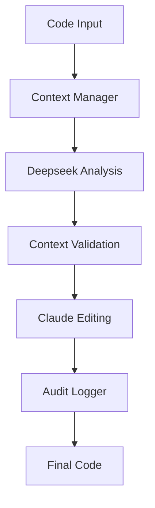

# Budget-Coder

Budget-Coder is an intelligent code analysis and editing pipeline that provides enterprise-grade code understanding and modification capabilities at a fraction of the cost. By leveraging the power of Deepseek R1 combined with Claude Sonnet's precise editing, it delivers high-quality code analysis and modifications while maintaining comprehensive project context.

## Key Features

### 1. Cost-Effective Intelligence
- Uses Deepseek R1 for deep code analysis (significantly cheaper than GPT-4)
- Leverages Claude Sonnet for precise edits (better price-performance ratio)
- Optimizes token usage through smart context management
- Maintains high quality while reducing API costs

### 2. Smart Context Management
- Supports comprehensive context including:
  - Code to be analyzed/modified
  - Conversation history for better task understanding
  - Related project files for broader context
  - Project configuration and settings
- Preserves project knowledge and relationships
- Maintains comprehensive audit trail

### 3. Intelligent Pipeline
- **Analysis Phase (Deepseek R1)**
  - Deep code structure understanding
  - Pattern recognition
  - Improvement suggestions
  - Dependency analysis
  
- **Edit Phase (Claude Sonnet)**
  - Precise code modifications
  - Context-aware changes
  - Documentation updates
  - Test considerations

### 4. Enterprise Features
- Comprehensive audit logging
- Error recovery mechanisms
- Rate limit management
- Token usage optimization

## Getting Started

### Prerequisites
- Node.js 18 or higher
- OpenRouter API key (for Deepseek and Claude access)
- MCP-compatible environment

### Installation
1. Clone the repository:
```bash
git clone https://github.com/SimoKiihamaki/Budget-Coder.git
cd Budget-Coder
```

2. Install dependencies:
```bash
npm install
```

3. Configure environment:
```bash
cp .env.example .env
# Edit .env with your OpenRouter API key
```

4. Build the project:
```bash
npm run build
```

### MCP Integration
Add to your MCP settings (typically in cline_mcp_settings.json):
```json
{
  "mcpServers": {
    "code-pipeline": {
      "command": "node",
      "args": ["path/to/Budget-Coder/build/index.js"],
      "env": {
        "OPENROUTER_API_KEY": "your-api-key"
      },
      "disabled": false,
      "autoApprove": [],
      "alwaysAllow": []
    }
  }
}
```

## Usage

### Code Analysis and Editing
```typescript
await use_mcp_tool({
  server_name: "code-pipeline",
  tool_name: "analyze_and_edit",
  arguments: {
    // Required: Code to analyze/modify
    context: "function add(a, b) { return a + b; }",
    
    // Optional: Specific task description
    task: "Add TypeScript type annotations",
    
    // Optional: Previous conversation for context
    conversationHistory: "User requested to add type annotations...",
    
    // Optional: Related project files for context
    files: [
      {
        path: "tsconfig.json",
        content: "{ \"compilerOptions\": { ... } }"
      }
    ]
  }
});
```

The tool will analyze the code considering all provided context and return suggested improvements. For example:

```typescript
// Input
function add(a, b) { return a + b; }

// Output with type annotations
function add(a: number, b: number): number {
  return a + b;
}
```

## Cost Benefits

### Token Optimization
- Smart context extraction reduces token usage
- Efficient model selection based on task
- Caching and reuse of analysis results
- Automatic token limit management


## Features

### Intelligent Analysis
- Deep code understanding
- Pattern recognition
- Security analysis
- Performance optimization
- Best practice enforcement

### Precise Editing
- Context-aware modifications
- Style preservation
- Documentation updates
- Test considerations
- Error prevention

### Enterprise Ready
- Comprehensive logging
- Audit trails
- Error recovery
- Rate limiting
- Token optimization

## Architecture



## Contributing

1. Fork the repository
2. Create your feature branch (`git checkout -b feature/amazing-feature`)
3. Commit your changes (`git commit -m 'Add amazing feature'`)
4. Push to the branch (`git push origin feature/amazing-feature`)
5. Open a Pull Request

## License

This project is licensed under the MIT License - see the [LICENSE](LICENSE) file for details.

## Acknowledgments

- Deepseek team for their excellent model
- Anthropic for Claude Sonnet
- OpenRouter for API access
- MCP community for the framework

Remember: Budget-Coder provides enterprise-grade code analysis and editing capabilities while significantly reducing costs through smart model selection and efficient token management.
